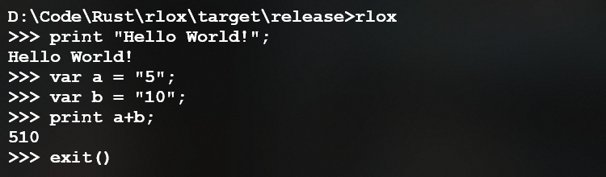
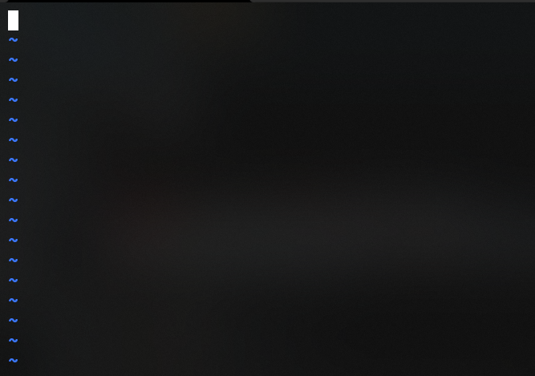
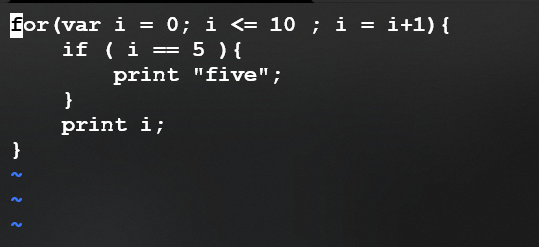
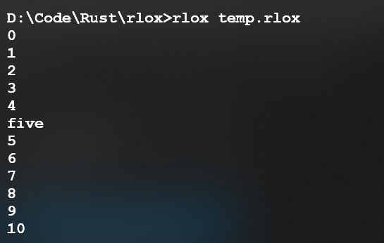
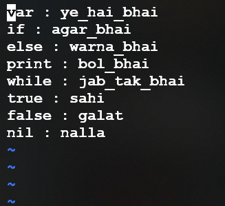
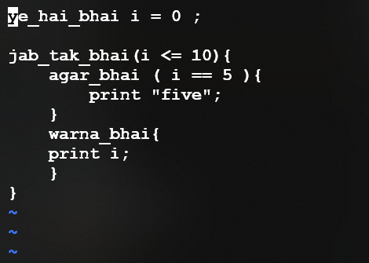
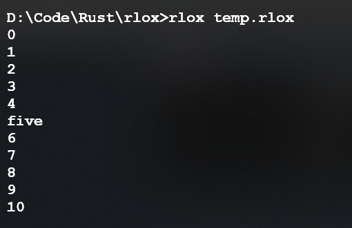

<h1 align="center">RLox</h1>

<p align="center">
 This is the official repository for RLox.<br><br>
 <b>RLox is a programming language written in Rust, solely designed to make memes.</b>
</p>

<h2 align="center">Usage</h2>
REPL:
Type 
<code>rlox</code> in the terminal to start repl mode which looks like :



You can run your file simply by typing <code>rlox [file name]</code> replace file name with your file name example:


| .tokenfile| Code |
|-----------|------|
| ||
|Output  ->||

**You can change keywords if you want**

| .tokenfile| Code |
|-----------|------|
| ||
|Output  ->||

yes this is similar to [bhialang](https://github.com/DulLabs/bhai-lang) you can find the preset for this in presets folder you can also add your presets to this repository for others to use refer [contribution guidelines](CONTRIBUTING.md) to raise pr.

my personal favourite:
| .tokenfile| Code |
|-----------|------|
|```print : hello_world ```|```hello_world "print"```|
|```print```|

<h2 align="center">Installation</h2>

Windows: Check the releases section.
Linux: You will figure out how to build this project dont worry.
Mac: We recommend using an emulator. Just ignore the overheating and random crashes.

<h2 align="center">Documentation</h2>

<h3 align="center">General</h3>
<p align="center">start of the file is the entrypoint for the program.</p>

```
// your code
// anything after '//' is comment
/* This is for multiline comment */ 
```

<h3 align="center">Variables</h3>
<p align="center">Variables can be declared using <code>var</code>.</p>

```
var a = 5 ;
var b = 6.9 ;
var c = "Hello World";
var d = true ;
var e = false ;
var f ;// nil is assigned by default

```

<h3 align="center">Types</h3>
<p align="center">Numbers strings and boolean are like other languages. Null values can be denoted using <code>nil</code>.

```
var a = 5 ; //integer
var b = 6.9 ; //float
var c = "Hello World"; //string
var d = true ; // boolean
var e = false ; // boolean
var f ; // nil is assigned by default

```

<h3 align="center">Built-ins</h3>
<p align="center">Use <code>print</code> to print anything to console.</p>

```
var a = 5;
print a ; //prints a to the terminal adds a \n by default so you don't have to manually
```

<h3 align="center">Conditionals</h3>
<p align="center">RLox supports if else blocks <code>if</code> block execute only if condition given is <code>true</code>. else block is optional and only executes if condition given is <code>false</code>.RLox also supports <code>and</code> and <code>or</code> logical operator.

```

var a = 5 ;

if (a == 5){
    print a ;
}
else {
    print b ;
}

```

<h3 align="center">Loops</h3>
<p align="center">Statements inside <code>while</code> blocks are executed as long as a specified condition evaluates to <code>true</code>. If the condition becomes <code>false</code>, statement within the loop stops executing and control passes to the statement following the loop.</p>


```

var a = 0;
while (a<10){
    a = a + 1;
    if (a==5){
        print a ;
    }
}
```

<h3 align="center" id="dynamic_scanner">Dynamic Scanner</h3>
When scanning the code, RLox's scanner looks for a <code>.tokenfile</code> file in your directory. If the file exists, it replaces reserved keywords with the tokens defined in the file.


Make sure the tokens you replace are listed below:
* Pattern to replace tokens is as follows:
    * Native_Token_Name : Your_Desired_Token_Name
* **Note:** Token names should be alphanumeric and can contain underscores between them.

<h3 align="center">Tokens</h3>

- [x] var
- [x] print
- [x] true
- [x] false
- [x] nil
- [x] if
- [x] else
- [x] or
- [x] and
- [x] while
- [x] for
- [ ] class
- [ ] fun
- [ ] super
- [ ] this